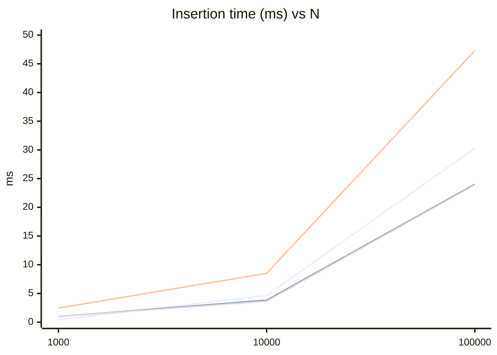
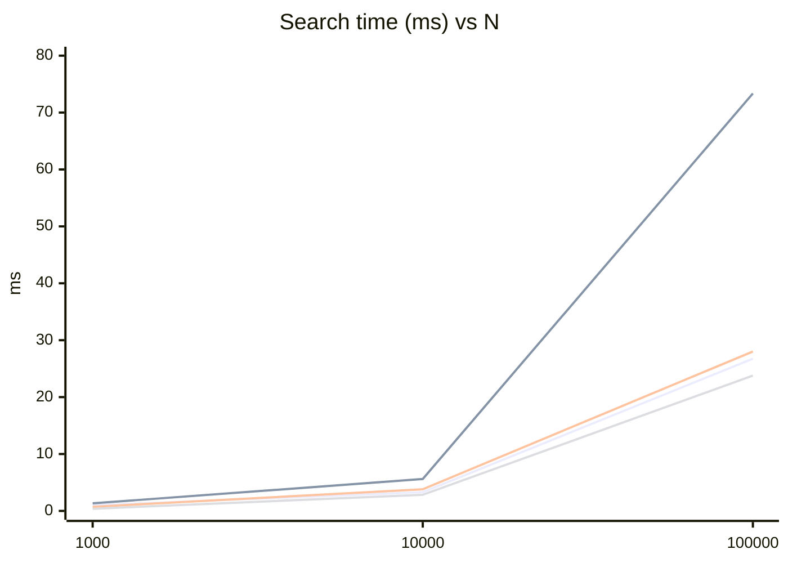
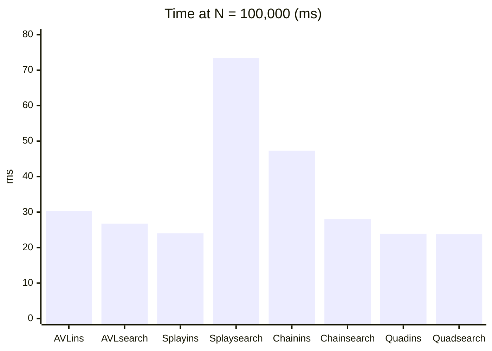

# CS 3345 – Assignment 2: AVL Tree, Splay Tree, and Hash Tables

## Student information

| Field   | Value |
|--------|--------|
| **Name**   | Shreekar Dittakavi |
| **NetID**  | SXD230177 |
| **Section** | 005 |

---

## System configuration

| Item | Details |
|------|---------|
| **Java version and vendor** | OpenJDK 26.0.2 (OpenJDK Runtime Environment, OpenJDK 64-Bit Server VM) |
| **Operating system** | Linux 6.19.8-arch1-1 (x86_64) |
| **CPU** | AMD Ryzen 5 PRO 5675U with Radeon Graphics (6 cores / 12 threads) |
| **JVM heap (not customized)** | Initial heap ~8 MiB; max heap ~3.6 GiB (defaults from `java -XX:+PrintFlagsFinal`). No `-Xmx` / `-Xms` flags were set for the timed runs. |

*Replace the rows above with the machine you use for submission if it differs. Re-run `java Main` on that machine and update the performance tables so they match your environment.*

---

## Objective (assignment summary)

This project implements and compares **AVL trees**, **splay trees**, and **hash tables** (separate chaining and quadratic probing) on large, changing integer-key datasets. We time **insertion** of *N* unique keys (duplicates ignored) and **search** with *N* lookups split between existing and non-existing keys, for *N* ∈ {1,000, 10,000, 100,000}.

---

## Experimental setup

### Input sizes and key files

| Scale | Elements (*N*) | Table size (chaining)† | Table size (quadratic)† | Insert keys file | Search keys file |
|-------|----------------|------------------------|-------------------------|------------------|------------------|
| Small | 1,000 | 928 | 2,003 | `iter1_insert_keys.txt` | `iter1_search_keys.txt` |
| Medium | 10,000 | 8,329 | 20,011 | `iter2_insert_keys.txt` | `iter2_search_keys.txt` |
| Large | 100,000 | 83,329 | 200,003 | `iter3_insert_keys.txt` | `iter3_search_keys.txt` |

†*Assignment specification for ideal table capacities. The submitted hash table classes use modulo hashing on the current array/bucket count and **rehash** when load factors trigger growth, so effective capacities during the run follow the implementation’s growth policy rather than these fixed numbers unless you construct tables with those exact sizes.*

### Timing and memory methodology

- **Time:** `System.nanoTime()` before and after each batch of operations; elapsed time is reported in **milliseconds** (nanoseconds ÷ 1,000,000), per the assignment.
- **Warm-up:** `Main` runs repeated AVL insert/clear passes on the large insert file before any timed benchmarks to reduce JVM cold-start effects.
- **Memory:** Before measuring, the code runs `System.gc()`, sleeps 50 ms, then uses `Runtime.getRuntime()` with `totalMemory() - freeMemory()` before and after building each structure. **Limitation:** garbage collection and allocator behavior add noise; deltas are approximate and can show as zero for small structures when GC reclamation masks growth.

---

## Data structures and algorithms

### AVL tree (`AVL.java`)

A height-balanced binary search tree. After each insert, node heights and balance factors are used to apply **rotations** so that the balance condition (height difference between subtrees at most 1) holds. **Search** is standard BST search without restructuring. **Deletion** is not part of the timed benchmark loop in `Main` but the structure is designed to stay balanced after updates.

**Grader verification:** `getAVLKeyHeight(int key)` prints the height of the node holding that key (via internal lookup).

### Splay tree (`Splay.java`)

A BST where **search** and **splay-to-root** bring the accessed node to the root using **zig**, **zig-zig**, and **zig-zag** style rotations on parent pointers. **Insert** places a new leaf without splaying in this implementation; duplicate keys are rejected. Frequent accesses to the same keys tend to keep them near the root (good locality); arbitrary or adversarial access patterns can yield higher tree height temporarily.

**Grader verification:** `DFSSplayTree()` prints all keys in **depth-first search** order.

### Hash table — separate chaining (`SeparateChainingHashTable.java`)

**Hash function:** `hashCode()` of the key, reduced with **modulo** the number of buckets (negative remainders adjusted). **Collisions** are resolved by **separate chaining**: each bucket is a linked list of keys. **Search** scans the list in the bucket indexed by `myHash(key)`. The table **rehashes** into a larger prime bucket count when the load triggers it.

**Grader verification:** `getChain(int index)` prints every key stored in the chain at `index`.

### Hash table — quadratic probing (`QuadraticProbingHashTable.java`)

**Hash function:** same modulo style on the current table length. **Open addressing** with **quadratic probing**: if slot `h` is occupied by another key, probe `h + 1`, `h + 1 + 3`, … (incrementing the step by 2 each time, as in the classic \(i^2\) offset pattern from the initial probe). **Search** uses the same probe sequence. **Rehash** occurs when the load exceeds half the table size (implementation policy).

**Grader verification:** `getQuadraticIndex(key)` prints the array index where that key is stored, or indicates absence.

### Restrictions honored

Implementations avoid trivializing collections such as `HashMap`, `TreeMap`, etc., for the core structure logic. `java.util.LinkedList` is used only as the bucket container in chaining, which matches typical separate-chaining pedagogy.

---

## Performance results

*Numbers below were produced by `java Main` on the system listed in **System configuration** (same repository, key files `iter1_*` … `iter3_*`). Rounded to two decimal places.*

### Insertion performance (time in ms)

| Data Structure | 1,000 | 10,000 | 100,000 |
|----------------|-------|--------|---------|
| AVL Tree | 0.44 | 4.63 | 30.31 |
| Splay Tree | 0.98 | 3.82 | 24.02 |
| Hash Table (Chaining) | 2.46 | 8.51 | 47.30 |
| Hash Table (Quadratic) | 0.96 | 3.65 | 23.90 |

### Search performance (time in ms)

| Data Structure | 1,000 | 10,000 | 100,000 |
|----------------|-------|--------|---------|
| AVL Tree | 1.00 | 3.29 | 26.75 |
| Splay Tree | 1.33 | 5.61 | 73.36 |
| Hash Table (Chaining) | 0.72 | 3.81 | 28.01 |
| Hash Table (Quadratic) | 0.38 | 2.83 | 23.78 |

### Memory usage after building the structure (bytes, approximate)

| Data Structure | 1,000 | 10,000 | 100,000 |
|----------------|-------|--------|---------|
| AVL Tree | 0.00 | 406,064 | 3,455,728 |
| Splay Tree | 0.00 | 489,152 | 3,579,880 |
| Hash Table (Chaining) | 226,328 | 1,438,528 | 12,283,032 |
| Hash Table (Quadratic) | 88,584 | 818,344 | 6,291,440 |

*Small-N memory deltas can read as zero because of GC noise and baseline heap behavior, as discussed in the assignment.*

### Graphs

**Insertion time vs. *N* (log-scaled *N* for readability)**



**Search time vs. *N***



**Bar-style comparison at *N* = 100,000 (insert vs search)**



*If your Markdown viewer does not render Mermaid, paste the tables into a spreadsheet or use the suggested optional charts from the handout (line, bar, memory).*

---

## Discussion

### When each structure performs best or worst (in this experiment)

- **Hash table (quadratic probing)** had the **fastest searches** at every scale here and **competitive inserts** at large *N*. Open addressing avoids pointer-chasing per bucket but risks clustering; quadratic probing spreads probes compared to linear probing.
- **Hash table (chaining)** was **slowest on inserts** at large *N* in this run, likely due to list traversal on collisions, `contains` checks, and higher allocation overhead for many `LinkedList` nodes.
- **AVL tree** gave **predictable** \(O(\log N)\)-height behavior: insert and search times grew smoothly with *N* without the search spike seen in the splay tree at 100k.
- **Splay tree** **insert** was faster than AVL at 10k and 100k here (no rebalance work), but **search at 100k** was the **slowest** among the four. The workload alternates hits and misses and does not resplay the same hot keys repeatedly, so the tree does not stay shallow for repeated access; each search may still walk a long path before splaying.

### Trade-offs between speed and memory

- **Chaining** used the **most memory** in the reported deltas: explicit list nodes and bucket array overhead dominate.
- **Quadratic probing** stores **one array slot per cell** (plus tombstone logic in the implementation’s `HashEntry` design); memory sat **between trees and chaining** at 100k here.
- **BST variants** store **two child references (and parent for splay) per node**; AVL adds a height field. They used **less memory than chaining** in this run but **more than quadratic** at the largest *N*.

### Observations about splaying and balancing

- **AVL balancing** keeps height logarithmic, so search cost stays stable even under arbitrary key order from the files.
- **Splaying** optimizes for **temporal locality**; with a **mixed, one-pass search file**, the tree shape keeps changing and average path length for “cold” keys can remain high, which matches the large search time at *N* = 100,000.
- **Hashing** flattens average-case cost to near **O(1)** for search when load is reasonable and the hash spreads keys well.

---

## Conclusion

Across the three scales tested with the provided key files, **open-addressing hashing with quadratic probing** offered the best **search** times and strong **insert** performance. **AVL trees** traded a bit of insert cost for **stable logarithmic** behavior. **Separate chaining** remained easy to reason about but paid extra in **memory** and **insert** time in this setup. **Splay trees** were sensitive to the **access pattern**: without strong repetition of keys, **search** did not outperform balanced BSTs or hash tables at the largest *N*. Overall, **choice of structure should follow expected access skew, need for worst-case guarantees, and memory budget**.

---

## How to build and run

```bash
javac *.java
java Main
```

Ensure `iter1_insert_keys.txt`, `iter1_search_keys.txt`, … `iter3_*` are in the working directory (same folder as `Main.java`).

---

## Submission checklist (from handout)

ZIP should include:

1. All `.java` sources (modular, commented, compiling cleanly).
2. This report as **`README.md`** (or convert to **`README.pdf`** if your course requires PDF only).

---

*Course: CS 3345 – Data Structures & Algorithm Analysis. Assignment due per syllabus (Spring 2026 instance referenced Sunday 03/29/2026 11:59 PM CST in the handout).*
